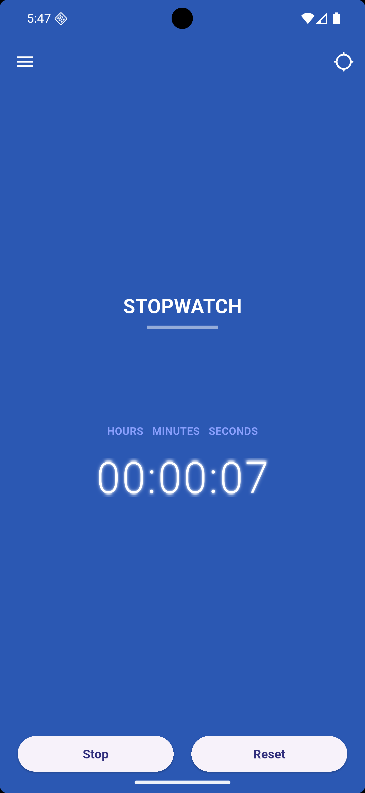

# ⏱️ Flutter Stopwatch UI

A beautiful Stopwatch application built using **Flutter** and **GetX**.

Inspired by a Dribbble design and recreated as a Flutter application for learning and portfolio purposes.

---

## 📱 Preview

<p align="center">
  
</p>

---

## 🎥 Demo

https://github.com/YourUsername/flutter-stopwatch-ui/assets/XXXXXXXXXXXX

> After uploading the repository, drag & drop `StopWatch_Practice.mp4` into the README editor on GitHub once. GitHub will automatically upload it and generate a permanent video URL like the one above. Replace the URL with the generated one.

---

## ✨ Features

- Beautiful Stopwatch UI
- Flutter + GetX
- HH : MM : SS Timer
- Start Stopwatch
- Stop Stopwatch
- Reset Stopwatch
- Responsive Layout
- Digital Clock Font
- Gradient UI

---

## 📂 Project Structure

```text
lib/
│
├── screens/
│   ├── controller/
│   │   └── stopwatch_controller.dart
│   │
│   └── screen/
│       └── stopwatch_screen.dart
│
├── utils/
│   ├── color_const.dart
│   └── ...
│
└── main.dart
```

---

## 🚀 Getting Started

```bash
git clone https://github.com/vikashbaria/flutter-stopwatch-ui.git

cd flutter-stopwatch-ui

flutter pub get

flutter run
```

---

## 🛠 Tech Stack

- Flutter
- Dart
- GetX

---

## 🎨 Design Inspiration

Original UI Design:

https://dribbble.com/shots/2829638-StopWatch-Day84-100-My-UI-UX-Free-SketchApp-Challenge

This repository contains my Flutter implementation of the design for educational and portfolio purposes.

---

## 👨‍💻 Author

**Vikash Baria**

Flutter Developer | Python Automation | PHP Developer

- LinkedIn
- Upwork
- GitHub

---

## ⭐ Support

If you like this project, don't forget to ⭐ star the repository.